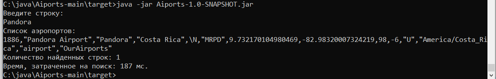
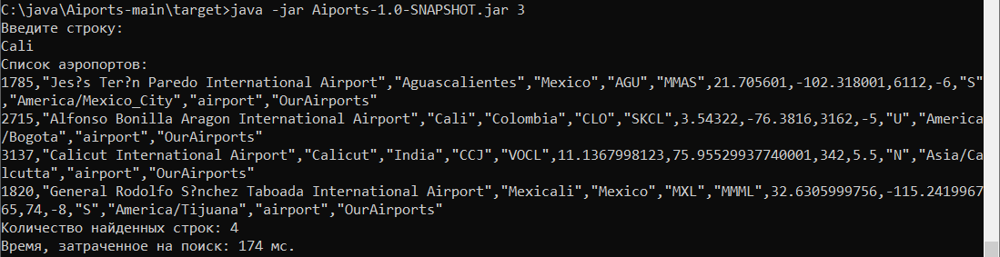

## **Аэропорты**
Консольное приложение для поиска

**Описание**

Поиск осуществляется в файле airports.dat, который содержит информацию о различных аэропортах. 
В настройках приложения (в свойствах) по умолчанию для поиска задана **вторая** колонка. Программа в консоли ждет ввода **текста** по которому будет осуществляться поиск. 
В результате пользователь получает отфильтрованный список значений аэропортов по выбранной колонке.

**Программа выводит в консоль:**

1. отфильтрованный и отсортированный по нужной колонке список аэропортов;
2. количество найденных строк;
3. время в миллисекундах, потраченное на поиск.

**Пример 1:**

Пользователь запускает программу, вызывая java -jar <имя файла сборки>. Программа по умолчанию ищет данные по второму столбцу:

**Пример 2:**

Так же пользователь может сам указать по какому столбцу осуществлять поиск:

**Итог:**
Надо в будущем ускорить поиск при помощи построения индексов.
